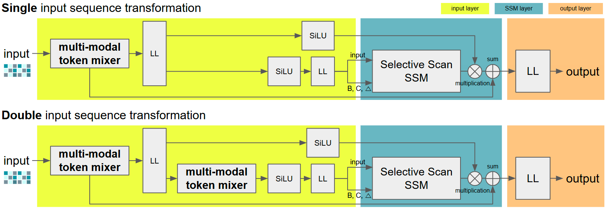
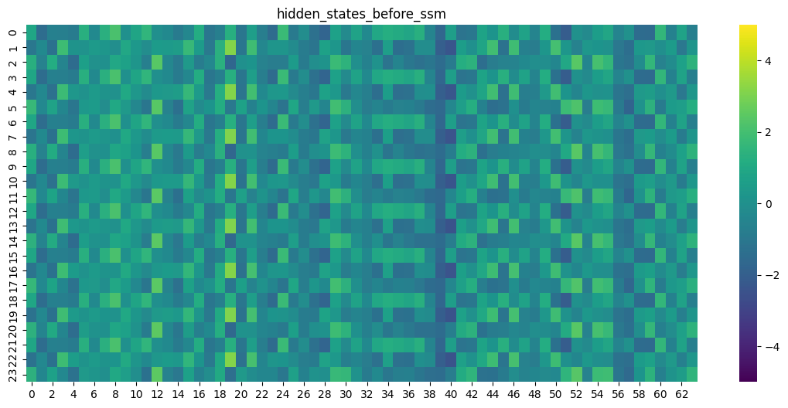
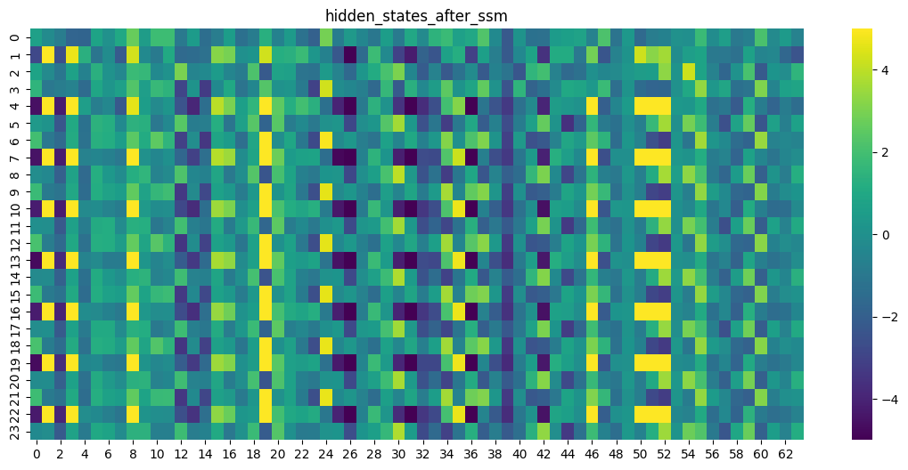
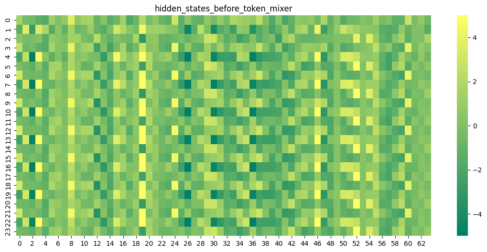
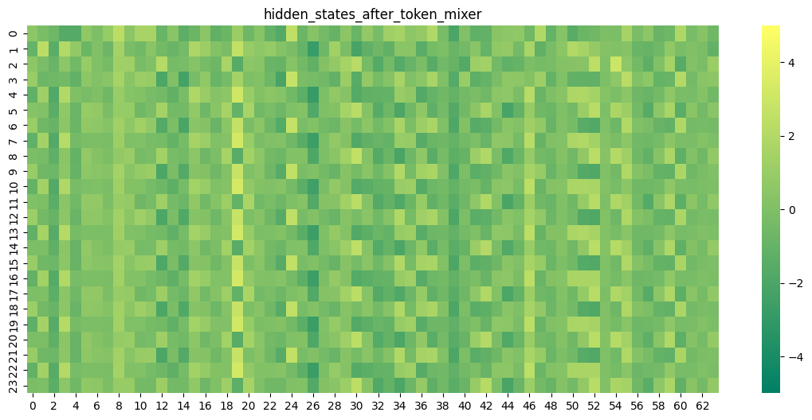

# Decision Metamamba

## Overview

Decision MetaMamba Architecture:


A link of the paper can be found on [arXiv](https://arxiv.org/abs/2408.10517).


## Instructions
You need to install the metamamba library first using pip.
Use the following command for installation:
```
cd path-to-DMM/metamamba
pip install -e .
```
After the installation is complete, you can train each dataset using the run.sh script.

## Feature Map Activation for Proximal and Distal steps

Hidden states before and after a Selective Scan SSM



Hidden states before and after a token mixer



## Acknowledgements
Our Decision Metamamba code is based on 
[decision-transformer](https://github.com/kzl/decision-transformer)
[decision-convformer](https://github.com/beanie00/Decision-ConvFormer).

and [mamba](https://github.com/state-spaces/mamba)


## Citation

Please cite out paper as:
```
@misc{kim2024integratingmultimodalinputtoken,
      title={Integrating Multi-Modal Input Token Mixer Into Mamba-Based Decision Models: Decision MetaMamba}, 
      author={Wall Kim},
      year={2024},
      eprint={2408.10517},
      archivePrefix={arXiv},
      primaryClass={cs.LG},
      url={https://arxiv.org/abs/2408.10517}, 
}
```

## License

MIT
